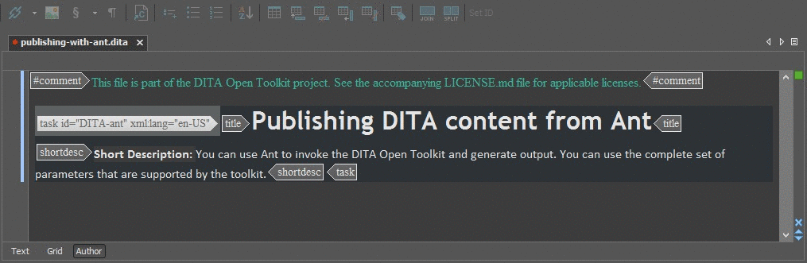

# oxygen-actions

Collection of custom oXygenXML actions, organized by framework.

Running version: 18.1

Creating custom actions
-----------------------------------

1. Navigate to `Options > Preferences > Document Type Association`.
2. Select the framework.
3. In the `Author` tab, go to the `Actions` subtab and click +.
4. Define the action properties.
5. Click `OK`.

Add custom Actions to the oXygen toolbar
-----------------------------------

1. Navigate to `Options > Preferences > Document Type Association`.
2. Select the framework.
3. In the `Author` tab, go to the `Toolbar` subtab.
4. Add the custom Action to the list of Current actions.
4. Define the action properties.
5. Click `OK`.

Run actions automatically on save
---

Refer to the [ExecuteAuthorActionsOnSaveHook](https://github.com/oxygenxml/ExecuteAuthorActionsOnSaveHook) plugin.

Build a list of actions in PDF
---
$ npm install
$ node install
